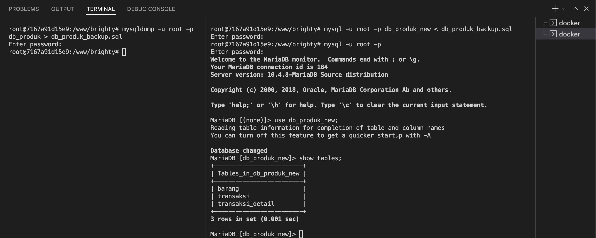
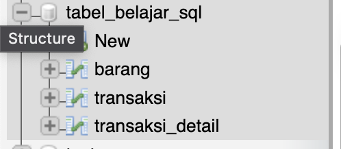
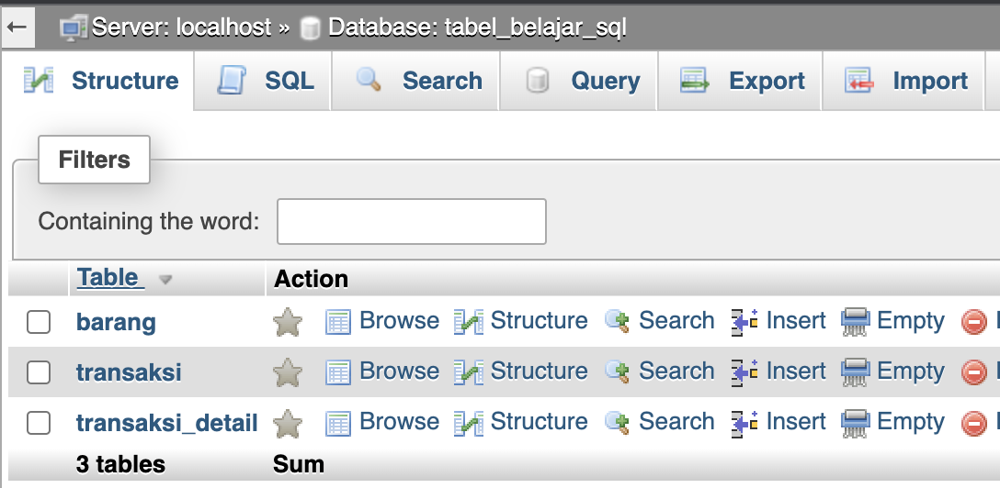
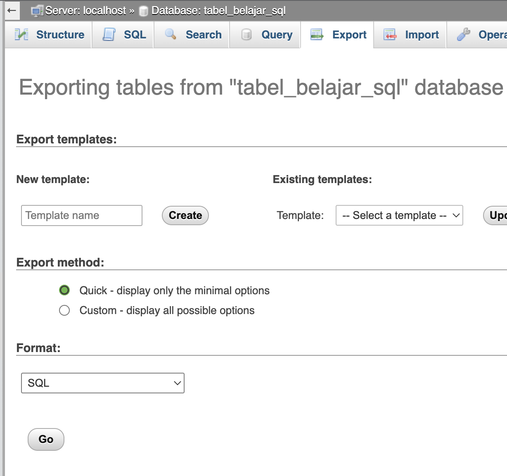
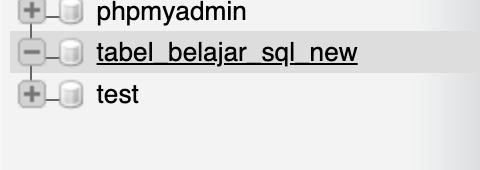
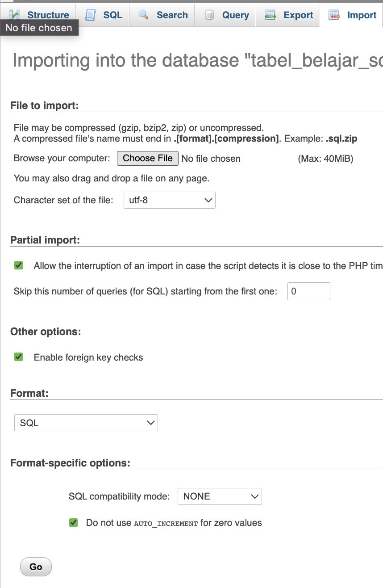
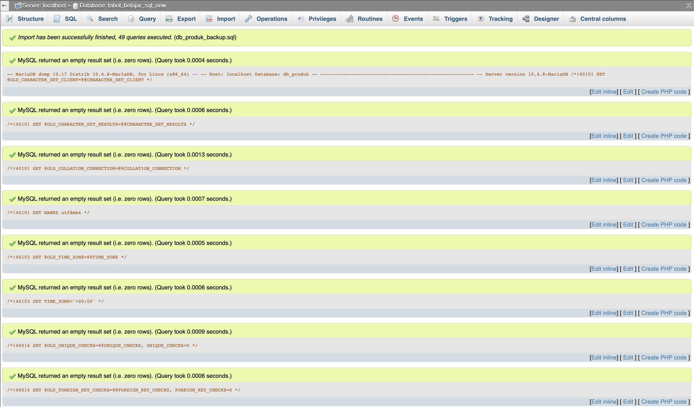
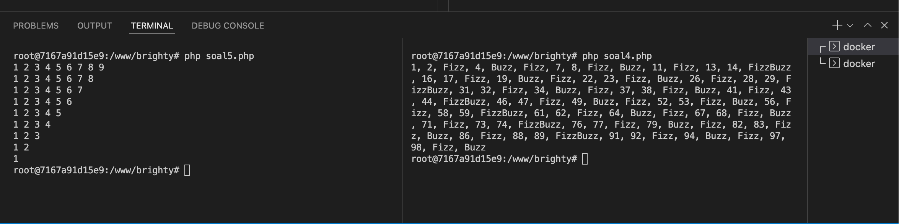

## Apa itu MySQL?
- MySQL menurut saya adalah sebuah aplikasi atau media untuk _Database Management System_ bertipe relational (atau biasa dikenal dengan RDBMS) yang bisa mengelola data (misal produk, karyawan, dan lainnya) dengan menggunakan sintaks / perintah untuk mengolah data tersebut.

## Berikan contoh perintah untuk:
- Select: 
    ```sql
    SELECT * FROM produk WHERE harga > 100000;
    ```
- Insert: 
    ```sql
    INSERT INTO produk (nama, harga) VALUES ('Brighty Glowing Underarm', 99000); -- dengan asumsi, id adalah auto increment.
    ```
- Update: 
    ```sql
    UPDATE produk SET nama = 'Brighty Underarm Scrub' WHERE id = 12;
    ```
- Delete: 
    ```sql
    DELETE FROM produk WHERE id = 12;
    ```
- Distinct:
    ```sql
    SELECT DISTINCT nama FROM produk;
    ```
- Like:
    ```sql
    SELECT * FROM produk WHERE nama LIKE '%Scrub%';
    ```

## Jenis Jenis Join
Berikut adalah jenis join yang biasa digunakan:
1. Inner Join
    > Inner Join adalah jenis join yang akan mengembalikan nilai JIKA kedua tabel memiliki kolom yang sama. Contoh syntax:
    ```sql
    SELECT a.id, a.nama, a.harga, a.nama_kategori FROM produk a INNER JOIN kategori b ON a.id_kategori = b.id;
    ```

2. Left Join
    > Left Join adalah jenis join yang akan mengembalikan seluruh data tabel A, meskipun reference key tabel B berisi data yang sama dengan reference key tabel A maupun NULL. Contoh syntax
    ```sql
    SELECT a.id, a.nama, a.harga, a.nama_kategori FROM produk a LEFT JOIN kategori b ON a.id_kategori = b.id;
    ```

3. Right Join
    > Right Join adalah jenis join yang akan mengembalikan seluruh data tabel B, meskipun reference key tabel A berisi data yang sama dengan reference key tabel B maupun NULL. Contoh syntax
    ```sql
    SELECT a.id, a.nama, a.harga, a.nama_kategori FROM produk a RIGHT JOIN kategori b ON a.id_kategori = b.id;
    ```

## Cara Backup dan Restore Database MySQL
- Sebagai contoh, credentials mysql anda adalah sebagai berikut:
    ```
    username                            : root
    password                            : root
    nama database yang ingin di backup  : db_produk
    nama database yang ingin di restore : db_produk_new
    ```
1. Dengan asumsi bahwa anda tidak memiliki akses ke Database Client (Misal phpMyAdmin) dan hanya bisa melalui terminal, maka anda bisa menggunakan perintah berikut:
- Backup Database:
    ```bash
    mysqldump -u root -p db_produk > db_produk_backup.sql
    ```

    - Perintah ini akan menyimpan semua data dari database yang bernama db_name ke dalam file db_name.sql.
    - Perintah ini bisa digunakan untuk backup database.

- Restore Database:
    ```bash
    mysql -u root -p db_produk_new < db_produk_backup.sql
    ```

- hasil backup dan restore menggunakan _command line_


2. Dengan asumsi bahwa anda memiliki akses ke Database Client (Misal phpMyAdmin):
- Backup
    - Buka Database Client: contoh: [phpMyAdmin](http://localhost/phpmyadmin)
    - Login menggunakan Username dan Password
    - Pilih Database yang ingin di backup (misal: tabel_belajar_sql)
    
    - Pilih menu `Export` pada menu bar di atas
    
    - Tekan Tombol `Go`, lalu anda akan menerima file sql
    

- Restore
    - Buka Database Client: contoh: [phpMyAdmin](http://localhost/phpmyadmin)
    - Login menggunakan Username dan Password
    - Pilih Database yang ingin di restore (misal: tabel_belajar_sql_new)
    
    - Pilih menu `Import` pada menu bar di atas
    
    - Klik Tombol Choose File, dan Pilih file sql yang sudah di backup
    - Tekan Tombol `Go`, lalu anda akan menerima pesan sukses
    


## Test Result
